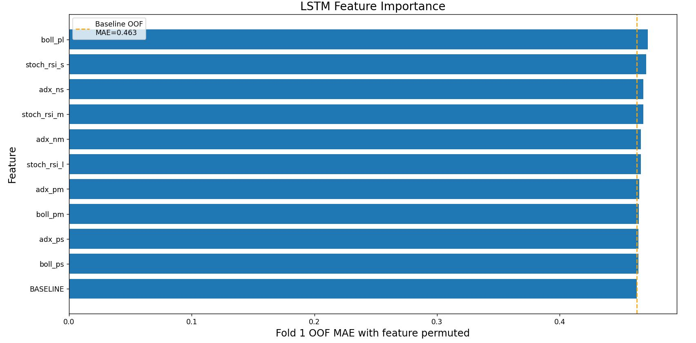

# LSTM Crypto Price Prediction 🎯
The goal of this project is to predict the price trend of a given cryptocurrency using an LSTM-RNN. Technical analysis is applied to historical cryptocurrency price data in attempt to extract price action for automated trading. The output of the network indicates trend direction probability and can be used to trade crypto through Binance API.

### Requirements
* Python-binance(https://github.com/sammchardy/python-binance)
* Keras (RNN)
* Scikit 
* numpy
* scipy (Savitzky-Golay filter)
* plotly and matplotlib (if designated graphing flag is set)
* ta (technical analysis)

## Labeling
The price of cryptocurrency tends to be very volatile and sporadic making it difficult to find underlying trends and predict price reversals. In order to smooth the historical price data without introducing latency, a [Savitzky-Golay filter](https://docs.scipy.org/doc/scipy-0.16.1/reference/generated/scipy.signal.savgol_filter.html) is applied. The purpose of this filter is to smooth the data without greatly distorting the signal. This is done by fitting sub-sets of adjacent data points with a low-degree polynomial by the method of linear least squares. This filter looks forward into the data so it can only be used to generate labels on historic data. The first-order derivative is then taken to find the slope of the filtered data to indicate upwards and downwards movements about the zero axis. This can be seen in the following figure:    
     

This approach was adopted from Kurtis Streutker`s open source project
The goal of this project was to make it at least a zero profit trading bot (after fees deduction)
    
## Technical Analysis Indicators
The following technical analysis indicators(features) are used for LSTM-RNN

* Stochastic RSI
* Bollinger Bands
* Average Directional Index
* Donchian Channel
* Stochastic Oscillator
* Williams R Indicator
* Keltner Channel
* True Strength Index
  
  All indicators affect model accuracy, thus all of them contain useful information about trend

    
   
## How it works
 * Crypto price and volume candles are downloaded with Binance API
 * Savitzky-Golay filter is calculated to indicate onward price direction, data is labeled according to slope direction
 * Features are calculated for trainig LSTM neural network, a. StratifiedKFold is used for better accuracy. 
 * Test data is processed and predictions are recieved, 
 * Trading benchmark calculates results in % to initial account balance. Trades profit histogram is shown
 * Graph is plotted to show price candles, model predictions and trading activity all in one screen
 
## Features
*  Bayesian optimisation algorithm for automated search of optimal network architecture
*  StratifiedKFold for using whole dataset available
*  Indicator importance research for better choice of indicators
*  Strategy benchmark 

## Results
This software is capable of extracting profit regardless of currency and its trends, but beating fees appears challenging and fine tuning is required. 
The validation accuracy of the network is ~65%, it can be used for automated trading and was verified on ETH, XRP, SOL, LTC and BTC.

## Improvement options
* Introducing a task-specific loss function for regression. It should focus more on predicting correct direction of price and less on value of derivative.
* Adding new features and feature engineering
* Fine tuning parameters 

### Trading tests
Data from Binance was pulled for 01 Dec 2023 - 26 Jun 2024. The data within this long period has a lot of price action and should be a good simulation for the trading bot. 
This test was done by applying the saved models` averaged predictions to the data, making fake trades and deducting fees. 
The results of the test period are as follows (with trading fee):

ETH:
Long orders: +~55%, Short orders: +~25% (zero fee)
Holding: +57%

BTC:
Long orders: +~50%, Short orders: +~30% (zero fee)
Holding: +72%

Creating a more task-specific loss function could improve the model as it should prioritize strong signals over signals with weak dynamics. Reinforcement learning should also be explored.

*Code developed by Dmitrii Sidorov and Kurtis Streutker(Savitzky-Golay implementation)*
   
